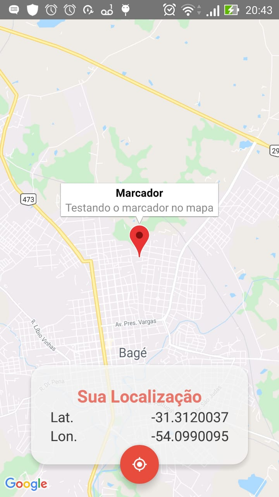

# Native-Mapa

### Mobile

Resultado da aplicação mobile utilizando Mapa:

<h1 align="center"></img></h1>
<br>

Para ver a aplicação mobile com o React Native primeiro é necessário configurar o adb e a chave da api no ./android/app/src/main/AndroidManifest.xml, e depois executar os comandos:

```bash
npm install
react-native start
```
